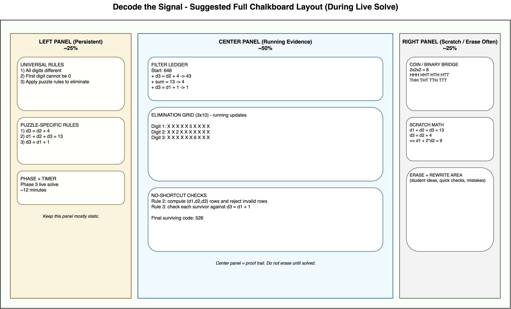

# Chalkboard Script — Decode the Signal
### 35-Minute Core + Optional Extensions

Use this as a live facilitation script.
Each phase gives you exactly what to draw, what to say, and what to ask.

Print-ready note:
- This Markdown file includes page-break markers for export.
- Run `./export_chalkboard_markdown.sh` in this folder to generate a printable HTML from this Markdown.

---

## Quick Start (Use Tomorrow)

1. Write the Universal Rules Board first.
2. Run the condensed counting intuition bridge (coins -> binary table -> decimal place value).
3. Deliver the full Voyager hook and mission framing.
4. Solve one 3-digit puzzle live with the class using ledger + elimination grid.
5. Run pair practice (Appendix A).
6. Debrief and preview 5-digit as extension.

---

## Universal Rules Board (Write This First)

Write this exactly before any puzzle-specific rules:

| UNIVERSAL RULES (apply to every puzzle) |
|---|
| 1. All digits are different (no repeats). |
| 2. The first digit cannot be 0. |
| 3. We will apply puzzle-specific rules to eliminate possibilities. |

Teacher line:
- "Rule 2 is not optional. Digit 1 cannot be 0. We are making an ID code, not leaving the first slot empty."

---

## Core Lesson Map (35 Minutes)

| Phase | Time | Outcome |
|---|---:|---|
| 1. Counting Intuition Bridge | 7 min (or 2 min quick version) | Students justify multiplication of choices |
| 2. Hook + Mission Framing | 4 min | Students buy into mission story |
| 3. Live Solve (3-digit) | 12 min | Students apply elimination process |
| 4. Pair Work | 8 min | Students practice process independently |
| 5. Debrief + 5-digit Preview | 4 min | Students connect method to larger puzzle |

---

## Suggested Wide Chalkboard Layout

Use this layout so students always know where to look.

Balanced-use guidance:
- Left panel: write once, update only when switching puzzles.
- Center panel: never erase until the puzzle is solved; this is the "proof trail."
- Right panel: erase often; use for truth table, substitution, and quick checks.

Suggested center-panel stack (top to bottom):
1. Filter ledger table
2. Current elimination grid
3. Candidate check lines (for Rule 2 and Rule 3)

Teacher line:
- "Left side is our rules, center is our evidence, right side is our sandbox."

---

## Phase 1 — Counting Intuition Bridge (7 min)

If students already completed statistics/permutations recently, abbreviate this to 2 minutes:
- Keep only: `2 x 2 x 2 = 8` and `10 x 10 = 100`.
- Then move directly to Phase 2.

### Draw
1. `Coin 1: H/T` and `Coin 2: H/T`
2. Small outcome list: `HH, HT, TH, TT`
3. Add third coin as condensed table:

| Coin 1 | Coin 2 | Coin 3 | Outcome |
|---|---|---|---|
| H | H | H | HHH |
| H | H | T | HHT |
| H | T | H | HTH |
| H | T | T | HTT |
| T | H | H | THH |
| T | H | T | THT |
| T | T | H | TTH |
| T | T | T | TTT |

4. Decimal bridge:
- `Two decimal digits: 00 to 99 -> 100 possibilities`
- `10 x 10 = 100`

### Say
- "Each coin has 2 outcomes. Three coins gives 2 x 2 x 2 = 8 outcomes."
- "That pattern is multiplication of choices per slot."
- "In decimal, each digit usually has 10 possibilities, so two digits gives 10 x 10 = 100."
- "In our puzzle, constraints reduce options, but the counting logic is still multiplication."

### Ask
- "Why is it multiplication, not addition?"
- "If I fix one slot, do I still have choices in the next slot?"
- "What class topic does this remind you of?" (Expected: binary counting / combinations by place.)

### Common misconception fix
- If someone says "3 coins means 2+2+2=6", respond:
  - "Let us test it by listing outcomes. We can count 8 outcomes, so addition misses combinations."

---

## Phase 2 — Hook + Mission Framing (4 min)

### Draw
- Title: `MISSION: DECODE THE SIGNAL`
- Under it: `Goal: Find the one possible ID that satisfies all rules.`

### Say
- "In 1977, NASA launched Voyager 1 with a Golden Record containing sounds and images from Earth."
- "But engineers also programmed a secret 'beacon signal ID' that would help identify the spacecraft if it is ever found by another civilization, or if we lose track of it ourselves."
- "The engineers designed the ID using divisibility rules so that any mathematician, human or alien, could verify it is authentic."
- "The ID is a number, and it must follow a specific set of mathematical rules."
- "Your job: decode the correct signal ID from the transmission logs."
- "We are the decoding team. We are not guessing. We are eliminating."

### Ask
- "What is the difference between a guess and a proof?"
- "How will we know we are done?" (Expected: one ID remains.)

### Teaching move
- If students jump to random guesses, say: "A code is only valid if it survives every rule."

---

## Phase 3 — Live Solve (3-digit core puzzle) (12 min)

### Puzzle for live solve

Write both sections clearly:

**Universal rules**
1. All digits are different.
2. First digit cannot be 0.

**Puzzle-specific rules**
1. Digit 3 is 4 more than digit 2.
2. The sum of all digits is 13.
3. Digit 3 is 1 more than digit 1.

### Draw (major board states)

1. Slot count setup:
- `Digit 1: 9 choices (1-9)`
- `Digit 2: 9 choices (0-9 except d1)`
- `Digit 3: 8 choices (not d1 or d2)`
- `Start = 9 x 9 x 8 = 648`

2. Filter ledger table:

| Rule | Remaining |
|---|---:|
| Start (universal rules only) | 648 |

3. Elimination grid template:

| Slot | 0 | 1 | 2 | 3 | 4 | 5 | 6 | 7 | 8 | 9 |
|---|---|---|---|---|---|---|---|---|---|---|
| Digit 1 |  |  |  |  |  |  |  |  |  |  |
| Digit 2 |  |  |  |  |  |  |  |  |  |  |
| Digit 3 |  |  |  |  |  |  |  |  |  |  |

### Say (scripted sequence)

- "We start at 648 valid IDs before puzzle-specific rules."
- "Now each new rule is a filter."

Rule 1 (`d3 = d2 + 4`):
- "What values of digit 2 are too large?"
- "If digit 2 were 6, digit 3 would be 10, impossible."
- "If the lowest d2 can be is 0, then d3 cannot be less than 4."

Update grid snapshot:

| Slot | 0 | 1 | 2 | 3 | 4 | 5 | 6 | 7 | 8 | 9 |
|---|---|---|---|---|---|---|---|---|---|---|
| Digit 2 |  |  |  |  |  |  | ❌ | ❌ | ❌ | ❌ |
| Digit 3 | ❌ | ❌ | ❌ | ❌ |  |  |  |  |  |  |

Update ledger:

| Rule | Remaining |
|---|---:|
| Start (universal rules only) | 648 |
| + Digit 3 is 4 more than digit 2 | 43 |

Rule 2 (sum is 13):
- "Substitute d3 = d2 + 4 into the sum rule."
- Write: `d1 + d2 + (d2 + 4) = 13 -> d1 + 2*d2 = 9`
- "Now test only d2 values that are still possible."

No-shortcuts elimination logic for Rule 2:

1. From Rule 1, we already know `d2` can only be 0, 1, 2, 3, 4, or 5.
2. Use the equation `d1 + 2*d2 = 9` to compute `d1 = 9 - 2*d2`.
3. Use Rule 1 again to compute `d3 = d2 + 4`.
4. Reject any row that breaks a universal rule (repeat digit, first digit 0, or non-digit value).

| d1 = 9 - 2*d2  | d2 | d3 = d2 + 4 | Keep? | Why |
|---:|---:|---:|---|---|
| 9 | 0 | 4 | Yes | Distinct digits, first digit not 0 |
| 7 | 1 | 5 | Yes | Distinct digits, first digit not 0 |
| 5 | 2 | 6 | Yes | Distinct digits, first digit not 0 |
| 3 | 3 | 7 | No | Repeats digit 3 |
| 1 | 4 | 8 | Yes | Distinct digits, first digit not 0 |
| -1 | 5 | 9 | No | `d1` is not a digit |

So Rule 2 leaves exactly four candidates: `904`, `715`, `526`, `148`.

Student sentence stems for Rule 2:
- "For `d2 = ___`, we get `d1 = ___` and `d3 = ___`, so this row is (valid/invalid) because ___."
- "I crossed out this row because it breaks rule ___."

Update grid snapshot after substitution on Rule 2:

| Slot | 0 | 1 | 2 | 3 | 4 | 5 | 6 | 7 | 8 | 9 |
|---|---|---|---|---|---|---|---|---|---|---|
| Digit 1 | ❌ |  | ❌ | ❌ | ❌ |  | ❌ |  | ❌ |  |
| Digit 2 |  |  |  | ❌ |  | ❌ | ❌ | ❌ | ❌ | ❌ |
| Digit 3 | ❌ | ❌ | ❌ | ❌ |  |  |  | ❌ |  | ❌ |

Update ledger:

| Rule | Remaining |
|---|---:|
| Start (universal rules only) | 648 |
| + Digit 3 is 4 more than digit 2 | 43 |
| + Sum of all digits is 13 | 4 |

Rule 3 (`d3 = d1 + 1`):
- "Check the 4 survivors against this final condition."

No-shortcuts elimination logic for Rule 3:

Check each surviving candidate directly against `d3 = d1 + 1`.

| d1 | d2 | d3 | Does d3 = d1 + 1? | Keep? |
|---:|---:|---:|---|---|
| 9 | 0 | 4 | No (`4 != 10`) | No |
| 7 | 1 | 5 | No (`5 != 8`) | No |
| 5 | 2 | 6 | Yes (`6 = 6`) | Yes |
| 1 | 4 | 8 | No (`8 != 2`) | No |

Only `526` survives, so this is not a trick. It is a complete elimination check of every remaining candidate.

Student sentence stems for Rule 3:
- "I tested `(d1,d2,d3) = (___, ___, ___)`. It (does/does not) satisfy `d3 = d1 + 1` because ___."
- "After Rule 3, the only surviving row is `(___, ___, ___)`, so the code is ___."

Update grid snapshot after Rule 3 is applied:

| Slot | 0 | 1 | 2 | 3 | 4 | 5 | 6 | 7 | 8 | 9 |
|---|---|---|---|---|---|---|---|---|---|---|
| Digit 1 | ❌ | ❌ | ❌ | ❌ | ❌ |  | ❌ | ❌ | ❌ | ❌ |
| Digit 2 | ❌ | ❌ |  | ❌ | ❌ | ❌ | ❌ | ❌ | ❌ | ❌ |
| Digit 3 | ❌ | ❌ | ❌ | ❌ | ❌ | ❌ |  | ❌ | ❌ | ❌ |

Final ledger:

| Rule | Remaining |
|---|---:|
| Start (universal rules only) | 648 |
| + Digit 3 is 4 more than digit 2 | 43 |
| + Sum of all digits is 13 | 4 |
| + Digit 3 is 1 more than digit 1 | 1 |

Final signal ID: `526`

### Ask
- "Which rule removed the most candidates?"
- "How did algebra help us avoid guessing?"
- "Why does the first-digit-not-zero rule matter in the count?"

### If students stall
- "Pick one possible d2 value and run the equation chain all the way through."

---

## Phase 4 — Pair Work (8 min)

### Draw
- Keep these visible: Universal Rules Board, filter ledger format, elimination grid format.

### Say
- "Now you will solve the Appendix A 3-digit puzzle in pairs."
- "One person proposes eliminations; one person verifies every step."

Use Appendix A directly:
- Copy the Appendix A rules to the board (or project that section).
- Students solve that puzzle using the same ledger + elimination grid process.

Roles:
- **Proposer**: states the next rule to apply and what it removes.
- **Checker**: validates arithmetic and universal rules.

At 4 minutes:
- "Switch roles."

### Ask (while circulating)
- "Which rule is strongest so far?"
- "Did you update both ledger and grid?"
- "Can you justify each cross-out with a rule?"

Teacher note:
- Keep Appendix B as an optional fun extension only if time remains.

---

## Phase 5 — Debrief + 5-digit Preview (4 min)

### Draw

| Rule | Remaining |
|---|---:|
| Start | 27,216 candidates |
| + Digit 2 is 5 less than digit 3 | 1,512 remaining |
| + Digit 1 is 2 less than digit 2 | 84 remaining |
| + Sum of all digits is 24 | 6 remaining |
| + Digit 4 is 2 more than digit 5 | 1 remaining |

### Say
- "Same process, bigger search space."
- "The method scales: count -> filter -> filter -> filter -> one survivor."

### Ask
- "What stays the same between 3-digit and 5-digit?"
- "What gets harder?"

---

## Board Checklist (at End of Core Lesson)

Make sure these are visible:
1. Universal Rules Board
2. Current puzzle-specific rules
3. Filter ledger
4. Elimination grid
5. Final surviving code

---

## Appendix A — Backup 3-digit Challenge (Answer: 961)

Use if core class finishes early or as next-day warmup.

### Rules to write explicitly

**Universal rules**
1. All digits are different.
2. First digit cannot be 0.

**Puzzle-specific rules**
1. Digit 2 is 5 more than digit 3.
2. Digit 2 is 3 less than digit 1.
3. Digit 1 is odd.

### Count path

| Rule | Remaining |
|---|---:|
| Start (universal rules only) | 648 candidates |
| + d2 = d3 + 5 | 36 remaining |
| + d2 = d1 - 3 | 2 remaining |
| + d1 odd | 1 remaining |

Final answer: `961`

---

## Appendix B — Backup 5-digit Challenge (Answer: 83214)

Use as extension station, small-group challenge, or day-2 opener.

### Rules to write explicitly

**Universal rules**
1. All digits are different.
2. First digit cannot be 0.

**Puzzle-specific rules**
1. Digit 5 is twice digit 3.
2. The sum of all digits is 18.
3. Digit 2 is 1 less than digit 5.
4. Digit 4 is odd.

### Count path

| Rule | Remaining |
|---|---:|
| Start (universal rules only) | 27,216 candidates |
| + d5 = 2*d3 | 1,176 remaining |
| + sum = 18 | 68 remaining |
| + d2 = d5 - 1 | 4 remaining |
| + d4 odd | 1 remaining |

Final answer: `83214`

---

## Quick Prompt Bank (Middle School Friendly)

| Goal | Prompt |
|---|---|
| Keep logic over guessing | "Which rule proves that?" |
| Reinforce universal rules | "Did you check no repeats and first digit not zero?" |
| Use elimination grid well | "Which exact digits can we cross out right now?" |
| Connect to prior learning | "Where do you see binary/place-value thinking here?" |
| Push explanation quality | "Say why that number is impossible in one sentence." |

---

Generate fresh puzzles anytime:
- `python puzzle_generator.py --digits 3`
- `python puzzle_generator.py --digits 3 --count 5`
- `python puzzle_generator.py --digits 5`
